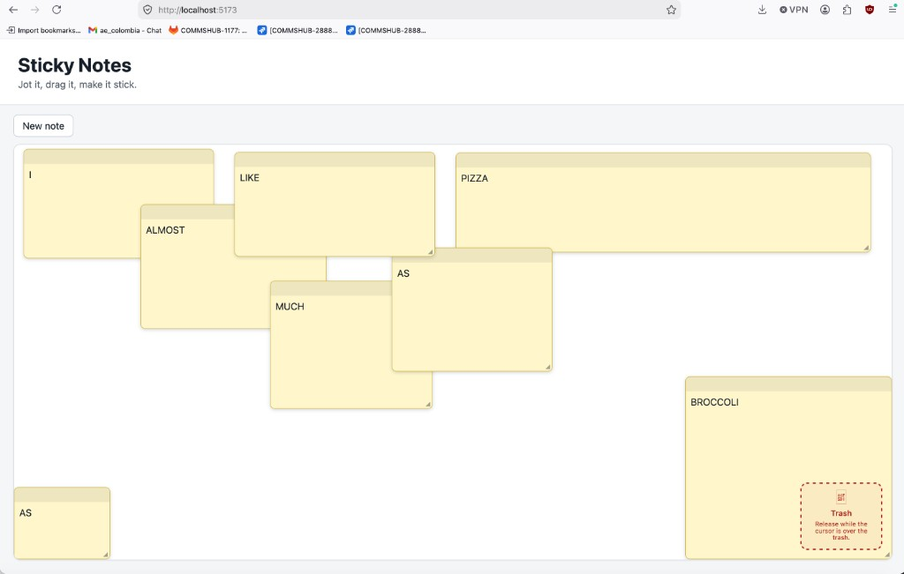

# Sticky Notes

A small desktop sticky-notes board built with React and TypeScript. You drag to create notes, drag them around, resize them, edit their text, and throw them away by dropping them on a trash zone. There's no drag-and-drop library behind any of it, the pointer handling is all hand-written, so it's easy to see exactly how the interactions work.



## What's implemented

- Drag on an empty board to create a note at the position and size you draw.
- Drag a note's header to move it.
- Drag the bottom-right handle to resize.
- Release the pointer while it's over the trash to delete a note.
- Undo the last deletion from a brief toast that appears after you throw a note away.
- Edit note text (plain text, controlled `<textarea>`).
- Bring a note to the front by interacting with it.
- Save and restore notes from local storage, with a versioned payload.
- Press `Escape` to cancel an in-progress gesture or disarm create mode.

## How to use it

1. Click **New note** in the toolbar. The button flips to **Drag on the board to create** to show it's armed.
2. Drag anywhere on the empty board to draw the note. A short click that doesn't really move won't create anything, so you don't get stray notes from a stray click.
3. Drag a note by its header (the strip along the top) to move it.
4. Drag the small handle in the bottom-right corner to resize.
5. To delete, pick a note up by its header and let go while the cursor is over the trash zone. The trash changes its label when you're actually over it, and it's the cursor position that counts, not whether the note overlaps.
6. Changed your mind? When you delete a note, a small "Note deleted / Undo" toast appears for about five seconds. Click **Undo** to bring that exact note back, same text, same size, same spot, and same stacking position.
7. Click into a note and type to edit it. Touching a note also selects it and brings it to the front.
8. Press `Escape` at any point to cancel the current drag, or to turn create mode back off.

Your notes are saved automatically a moment after you stop making changes, and they come back on reload.

## Commands and runtime

```bash
npm install      # install dependencies (generates package-lock.json if missing)
npm run dev      # start the Vite dev server
npm run check    # typecheck + lint + run tests + production build
npm run build    # production build into dist/
npm run preview  # serve the built output from dist/ for inspection
```

`npm run preview` is worth calling out: it serves the already-built production bundle so you can click through exactly what `npm run build` produced, rather than the dev server.

There's also an optional end-to-end smoke test, one Chromium run driven by Playwright, that I deliberately kept out of `npm run check` so the normal gate never has to pull down a browser. If you want to run it, grab the browser once and go:

```bash
npx playwright install chromium   # one-time, downloads the browser
npm run test:e2e                  # starts the dev server and runs the smoke test
```

It arms create mode, drags out a note, types into it, moves it, resizes it, reloads to prove the note came back from local storage, and finally drags it onto the trash to delete it.

I built and ran this with **Node v20.20.2** and **npm 10.8.2** on macOS. The `engines` field asks for Node >= 20.19.

## Architecture

The app keeps a firm line between committed data and the moment-to-moment noise of a drag. The notes themselves live in a small pure reducer ([`src/domain/notesReducer.ts`](src/domain/notesReducer.ts)) as an ordered array, and that array order _is_ the stacking order, so the last note in the list is the one on top. Every action returns the same state object when nothing actually changed and preserves the object references of notes it didn't touch, which is what lets `React.memo` on the note cards do its job. All positions are measured against a single element, the borderless, padding-free `boardSurface`, and that one element is the only coordinate space used for pointer math, previews, trash hit-testing, CSS positioning, and the rectangles I persist. Deletion is a small example of the committed-vs-ephemeral split: the removed note and its old index sit briefly in the board's ephemeral state to back the undo toast, while the actual restore is one pure reducer action that splices the note back into its original stacking slot.

Gestures use the Pointer Events API with pointer capture, so a drag keeps working even when the cursor leaves the note or slips outside the window. The raw pointer position is written to a mutable ref rather than React state; a single `requestAnimationFrame` turns that into at most one preview update per frame, and only the note being dragged gets new preview props. The detail I care most about is that the committed geometry is computed from the `pointerup` event itself, never from the last rendered frame (which can be a frame behind). Commit and cancel are deliberately separate paths, `Escape`, `pointercancel`, and lost capture all cancel without ever committing, and the gesture is cleared _before_ pointer capture is released so the trailing `lostpointercapture` event is a harmless no-op. That logic lives in [`src/features/board/useBoardGestures.ts`](src/features/board/useBoardGestures.ts).

Persistence is intentionally boring. The board starts in a `measuring` phase and, only once it has a real non-zero size, reads local storage, validates every stored note, normalizes the geometry to the current board, installs the notes, and flips to `ready` (see [`src/features/board/Board.tsx`](src/features/board/Board.tsx)). Saving is gated behind that `ready` flag and debounced by ~300 ms, which is what stops React Strict Mode's double-invoked effects, or the first empty render, from overwriting good saved data with an empty array. Everything treated as stored input is validated as `unknown` and narrowed in [`src/infrastructure/notesStorage.ts`](src/infrastructure/notesStorage.ts). I left out an external drag-and-drop library on purpose so the interaction engineering stays visible instead of hidden inside a dependency.

## Trade-offs

- **No drag-and-drop library.** The whole point of the exercise is the pointer handling, so hiding it behind a library felt like the wrong call. I wrote it directly.
- **No continuous re-layout on window resize.** Notes are normalized once at hydration and clamped whenever you commit a move or resize. I don't rewrite and re-save every note's position while you drag the browser window. It's out of scope and mostly just churn.
- **No `pagehide` flush.** The debounced save plus reload covers the realistic cases; a flush-on-unload path added complexity I didn't think was worth it here.
- **Focused unit tests over broad infrastructure.** I put tests where the real risk is (geometry, the reducer, persistence validation) instead of standing up a full browser-test or schema-validation stack.
- **Array order as z-order.** With a handful of notes, using array position for stacking keeps the reducer and persistence dead simple. It wouldn't be my choice for thousands of notes, but that isn't this.

## Browser support

Target: current Chrome, Firefox, and Edge on the desktop, per the brief. This is the compatibility goal, not a claim that every combination was hand-tested.

## What I actually tested

Manually clicked through create, edit, move, resize, reload, and trash-delete on:

- Chrome on macOS
- Firefox on macOS
- Chrome on Windows 11
- Firefox on Windows 11

I did **not** have Edge available to test by hand. It's a target and uses the same standards-based Pointer Events path as Chrome, but I'm not going to claim a manual pass I didn't do. On top of that, `npm run check` (typecheck, lint, unit tests, production build) passes, and the Playwright smoke test walks the whole happy path, create, type, move, resize, reload-and-persist, then drag-to-trash, in headless Chromium (`npm run test:e2e`).

## Known limitations

- Desktop-only by design; no touch/mobile-specific handling.
- Notes aren't repositioned live if the viewport changes after hydration, they're only clamped on the next commit.
- Undo covers only the single most recent deletion (a roughly five-second window, and it isn't persisted across reloads); there's no general undo/redo history.
- No note colors, no REST API, and no keyboard-driven move/resize.
- Edge is targeted but hasn't been manually verified.

## Time spent

Roughly 2 to 2.5 hours.
